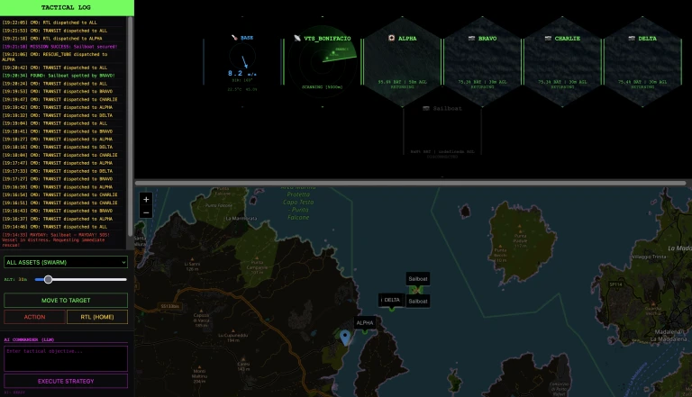
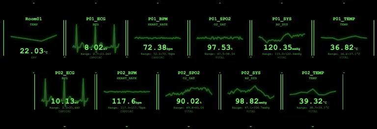

# 🐝 HORNET HIVE | Tactical Swarm C4I Station

A **Command, Control, Communications, Computers, and Intelligence (C4I)** station for autonomous drone swarms.

HORNET HIVE (HH) leverages MQTT, the most widely used communication protocol for the Internet of Things (IoT), to connect real or simulated devices to the Control Center. 
It also integrates Artificial Intelligence (AI) across multiple components to detect threats and interact with the operator.



HORNET HIVE can be used as a simulation game in various tactical scenarios (e.g., SAR – Search and Rescue) or connected to real-world components such as cameras, sensors, and drones.

The drone simulation component is complete in every aspect: flight physics, battery management, satellite view, and controls. Integration with external components such as RTSP cameras, object detection, sensors, and alarms with Telegram is also complete but requires specific customization and configuration. Drone flock management and AI-assisted flight control are a proof of concept (POC) and can be extended in various directions.

---

## 🚀 Execution (Gaming Scenarios)

The project includes pre-configured Docker scenarios for quick simulation startup:

### 1. Training Mode (Hornet Nest)

    docker-compose -f docker-compose.HH.yml up --build

This is the initial scenario for practicing with HH (Hornet Hive) CC (Control Center). The goal is to find a horse that has escaped in the countryside. The drone can fly over the entire area and visit the places indicated by the operator.

### 2. Maritime SAR (Bonifacio Strait)

    docker-compose -f docker-compose.SAR_bonifacio.yml up --build

The Strait of Bonifacio is a wonderful place for sailing. The goal is to find a boat in distress and launch a life raft.
The search can take some time: the area is quite large, there are several drones that need to be coordinated, and one that can launch the raft.

### 3. Facility Defense (Fukushima)

    docker-compose -f docker-compose.DEF_fukushima.yml up --build

Fukushima is a Japanese nuclear power plant famous for a serious nuclear accident. In this case, there are multiple objectives, such as checking for a leak in a reactor, tracking an intruder, and sending emergency services to a worker in distress.

### 4. Tactical Strike (Erbil)

    docker-compose -f docker-compose.MIL_erbil.yml up --build

This is a hypothetical but unfortunately very current scenario in which drones have defense and counterattack tasks.

Access the UI (User Interface) at: **http://localhost:3000**

> 💡 **Pro-Tip: Docker & Code Changes**
> If you modify any Python script (e.g., `target_mock.py`, `drone_mock.py`) or the Node.js backend, you **must** use the `--build` flag to apply the changes to the containers:
> `docker-compose -f docker-compose.HH.yml up --build`
> If you only change the `.yml` files or restart the simulation, the `--build` flag is not required and it takes more time.

### 🛸 Drones

The gaming scenarios are only initial examples! You can configure any scenario with any drone. There are several simulated drones (eg. DJI Mini4, AR5 life ray, R18, MQ9 Reaper) available that can operate in different scenarios with different objectives (eg. Training, SAR, Surveillance, Military), for a complete list see the **[Drones](doc/DRONES.md)** and **[Scenarios](doc/SCENARIOS.md)**.

For a complete list of tactical terms (SAR, C4I, WRA, RTL, etc.), see the **[Glossary](doc/GLOSSARY.md)** 📖.

---

## 🛰️ Tactical Features

- **Realistic Drone Physic**: A wide range of drones is simulated, taking into account their characteristics and limitations. In particular, the flight physics considers rotary versus fixed-wing models, the maximum speeds of each model, and battery consumption.
  Drones only recharge at base. Stranded assets outside the base automatically shut down after 120s.
- **Action Loop (OODA)**: Complete mission lifecycle: **Search** (Loitering), **Detect** (ISR), and **Action** (Rescue/Strike).
- **Mission Capabilities**: Drones are categorized by payload: 📷 (Sensor), 🛟 (Life-Raft), ⛑️ (Medkit), 🔥 (Strike).
- **Tactical Radar Mock**: Real-time proximity visualization of the swarm and potential targets on a circular scan interface.
- **Meteo station Mock**: Online information of wind and meteo informations.
- **Weapon Release Authority (WRA)**: Critical commands (STRIKE/ACTION) require a 30s confirmation window and an "Thumbs up" gesture from the operator via the **Authority Bridge**.
- **Spatial Context & POI**: Define key tactical locations (e.g., "Reactor_1", "Main_Gate") in scenarios. The AI Commander uses these to route the swarm with natural language commands.
- **Threaded Edge AI**: High-performance camera bridge with frame-dropping to handle real-time RTSP streams. The camera uses YOLOv8 object recognition to detect intrusions.
- **Alerting (Telegram/UI)**: Real-time mobile notifications.

---

## 🏗️ System Architecture

1. **Backend (Node.js/Express):** Scenario Authority & Orchestrator. Manages global state, WRA logic, and tiered logging.
2. **Frontend (Vanilla JS/Socket.io):** Dynamic Honeycomb HUD. Real-time telemetry, GIS mapping, and dynamic action buttons based on drone capability.
3. **Drone Simulator (Python):** High-fidelity drone simulation, images based .
4. **Target Simulator (Python):** Mock for dynamic/static objectives with MAYDAY signals and drift physics.
5. **Authority Layer (Python/MediaPipe):** Dedicated HMI bridge for operator gesture confirmation (WRA).
6. **Intelligence Layer (Python/YOLOv8):** AI vision modules for threat detection (ISR), can connect to any RTSP standard camera.
7. **AI Commander (Python/Ollama):** LLM-powered "Tactical Brain" for automated mission planning.
8. **Asset Layer (Python):** Physical (Tello, MAVLink) drones support.

---

## ⚙️ Installation & Setup

### 1. Prerequisites

- **Node.js** (v18+)
- **Python** (v3.12+)
- **Docker & Docker Compose** (for scenario deployment)
- **MQTT Broker** (e.g., Mosquitto)
- **Ollama** (for AI Commander)

### 2. Python Environment

It is highly recommended to use a virtual environment to manage dependencies:

    # Create and activate venv
    python3 -m venv .venv
    source .venv/bin/activate
    
    # Install dependencies
    pip install -r requirements.txt

### 3. Node.js Environment

```
npm install
```

### 4. 🧠 AI Models (Mandatory)

Large binary files are excluded from this repository. You must download them manually and place them in the project root:

- **YOLOv8n (Object Detection)**: [Download yolov8n.pt](https://github.com/ultralytics/assets/releases/download/v8.2.0/yolov8n.pt)
- **MediaPipe Hand Landmarker (Gesture Auth)**: [Download hand_landmarker.task](https://storage.googleapis.com/mediapipe-models/hand_landmarker/hand_landmarker/float16/1/hand_landmarker.task)

---

## 📂 Project Structure

```
.
├── server.js              # C2 Orchestrator & Scenario Authority
├── public/
│   ├── index.html         # Tactical Dashboard (Honeycomb OSD)
│   └── zoom.html          # Zoom display 
├── assets/
│   ├── scenarios.json     # Theater of Operations
│   ├── drone_models.json  # Drone physics, behavior & capabilities
│   ├── drone_mock.py      # High-fidelity Drone Simulator (Physics & Energy)
│   ├── target_mock.py     # Dynamic Objective Simulator (Mayday & Actions)
│   ├── camera_bridge.py   # AI Vision Bridge (Threat Detection / ISR)
│   ├── authority_bridge.py# Operator HMI (Gesture Auth / WRA)
│   ├── commander_ai.py    # LLM-powered Mission Orchestrator
│   ├── tactical_rules.json# Operational Doctrine & Mission Rules (AI context)
│   ├── radar_mock.py      # Tactical Proximity Radar Simulation
│   ├── data_mock.py       # Random data generator for both tech and medical context
│   ├── tello_bridge.py    # [POC] DJI Tello Hardware Integration
│   └── mavlink_bridge.py  # [POC] Industrial MAVLink Integration
├── logs/                  # Tiered Log Storage (Standardized)
├── yolov8n.pt             # AI Model: YOLOv8 (Object Detection)
├── hand_landmarker.task   # AI Model: MediaPipe (Gesture Auth)
├── docker-compose.*.yml   # Scenario-specific Docker deployments
├── mosquitto.conf         # Mosquitto MQTT configuration 
├── README.md              # Project Documentation
├── TODO.md                # Project Roadmap
└── doc/                   # Tactical Terminology and useful documentation
```

---

## 💻 Advanced Configurations & Native Execution

While Docker is easier for simulation and headless security, some features are best run natively to leverage specific hardware 
(eg. Apple GPU) or low-latency network access. Running Hornet Hive natively allows You to change any configuration.
All HH components comunicate via **[MQTT](doc/MQTT.md)** 📖 and can be dinamically added or removed.

### 0. 🖥️ Tactical Interface Guide

The **Hornet Hive C4I Dashboard** is an advanced hexagonal OSD (On-Screen Display) designed for high-stakes tactical awareness.
The User Interface is available at: **http://localhost:3000**

* **Tactical Sidebar** (Left): 
  * **Live Log**: Real-time chronological feed of swarm status, detections, and mission milestones.
  * **Mission Control**: Interactive panel to select assets, adjust flight altitude (AGL), and dispatch commands (Transit, RTL, or specialized actions).
    * **AI Commander** (LLM): Natural language interface to communicate with the tactical brain for automated strategy execution.
* **C4I Command Suite** (Right):
  * **Honeycomb Grid** (Center): Dynamic hexagonal array displaying real-time drone telemetry, satellite/camera feeds, radar sweeps, and IoT sensor data. Supports Drag & Drop to prioritize critical assets and Double-Click Zoom for isolated monitoring.
  * **GIS Tactical Map** (Bottom): High-contrast inverted map for real-time spatial tracking of the entire swarm, identified targets, and mission search areas.

### 1.  🏞️ Scenarios

HH comes with some already configured [Scenarios](doc/SCENARIOS.md)
but new ones can be easily added in the ```assets/scenarios.json``` file.

### 2. 🛸 Drones

HH comes with several already configured [Drones](doc/DRONES.md)
but new ones can be easily added in the ```assets/drone_models.json``` file.

### 3. 🎯 Target Simulator (target_mock.py)

The target simulator mimics an objective that must be found and serviced.
    python assets/target_mock.py --id VESSEL_01 --type ⛵️ --action RESCUE_TUBE --offset 1000,-500 --area 500
Each command in HH has a extensive help:

    usage: target_mock.py [-h] [--type TYPE] [--action ACTION] [--radius RADIUS] [--drift DRIFT]
                      [--area AREA] [--pos POS] [--offset OFFSET] [--max-alt MAX_ALT] [--delay DELAY]
                      [--mqtt-host MQTT_HOST] [--log] [--debug] [id]
    positional arguments:
    id                    Target ID
    options:
    -h, --help            show this help message and exit
    --type TYPE           Target Icon (⛵️, ⛑️, 🪖, 📡, ☢︎)
    --action ACTION       Required action (SENSOR, RESCUE_TUBE, MEDKIT, STRIKE)
    --radius RADIUS       Detection radius in meters
    --drift DRIFT         Drift speed in m/s
    --area AREA           Search area radius in meters
    --pos POS             Fixed starting position as X,Y (e.g. 500,-200)
    --offset OFFSET       Center of the random search area as X,Y (default 0,0)
    --max-alt MAX_ALT     Max altitude for detection (meters)
    --delay DELAY         Mean initial delay for activation (seconds)
    --mqtt-host MQTT_HOST
                          MQTT Broker Host
    --log                 Enable file logging
    --debug               Enable verbose debug output

### 4. 🧠 AI Commander & Ollama

For maximum performance on Apple Silicon (using Metal/MPS), run Ollama as a local service and the AI Commander natively.
Recommended models: `qwen2.5-coder:7b` or `llama3.1:8b`.
    python assets/commander_ai.py --model qwen2.5-coder:7b --debug
The AI commander uses different contexts to act properly in each scenario as described in the ```tactical_rules.json``` file.

### 5. 🛡️ AI Security & Alarm System

Hornet Hive can be deployed as a stand-alone intrusion detection system using YOLOv8 and Telegram.
There is a fully containerized sample for easy deployment on edge devices like Raspberry Pi or dedicated servers.

#### 5.1 Configure Environment

Set your Telegram Bot credentials and (optionally) camera RTSP streams:

    export TG_TOKEN="your_bot_token"
    export TG_CHAT="your_chat_id"
    export CAM_01_URL="rtsp://..." # Optional, defaults to local webcam 0
    export CAM_02_URL="rtsp://..."  # Optional, defaults to local webcam 1

#### 5.2 Launch Alarm Stack

    docker-compose -f docker-compose.ALARM.yml up --build

### 6. 📷 Real Cameras and  🌡️ DIY Sensors

The Hornet Hive Comman Center con be used with real-world Cameras and Sensors.
RTSP Cameras, ESP-32, Raspberry and Arduino One kits have been successfully tested
and can be easily integrated with HH using the provided mocks or by sending the provided MQTT messages.
Some tips and tricks for connecting external devices are collected this document: **[Integrations](doc/REAL.md)** 📖.

#### 6.1 📊 Data mocks

A powerful random data mock can be used to generate data streams, HH automatically shows the graphs in the honeycomb. Both technical and medical data can be simulated as fully described in **[Data visualization](doc/DATA_VISUALIZATION.md)** 📖 but... a picture is worth a thousand words:



### 7. 🛸 Real Drones (Tello / MAVLink)

To avoid Docker network overhead and latency, run hardware bridges directly in your local Python environment:

    python assets/tello_bridge.py

It's better to use the dedicated WiFi network.

---

## 🤝 Contributing

HornetHive is a live project: check current state in the [Project Roadmap](TODO.md) 📖.

Contributions are welcome! Whether it's a bug report, a new feature, or a simulation scenario, feel free to open an issue or submit a pull request. 

1. Fork the Project.
2. Create your Feature Branch (`git checkout -b feature/AmazingFeature`).
3. Commit your Changes (`git commit -m 'Add some AmazingFeature'`).
4. Push to the Branch (`git push origin feature/AmazingFeature`).
5. Open a Pull Request.

---

## ⚖️ License

Distributed under the Apache License 2.0. See `LICENSE` for more information.

---

*Developed for high-performance tactical simulation and AI-Swarm research.*
